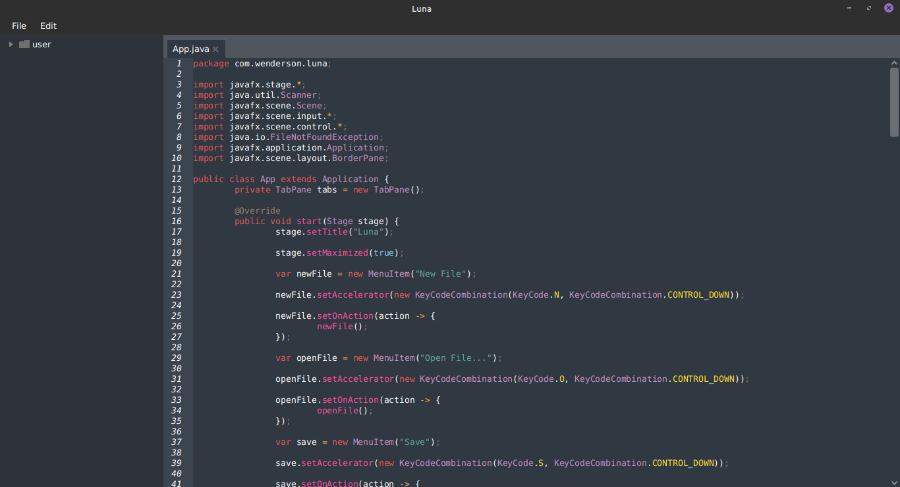

# Luna

A Luna é uma IDE open source, moderna e multiplataforma, escrita em Java com JavaFX e [RichTextFX](https://github.com/FXMisc/RichTextFX/). Atualmente ela possui somente funcionalidades básicas como realce de sintaxe e explorador de arquivos.

